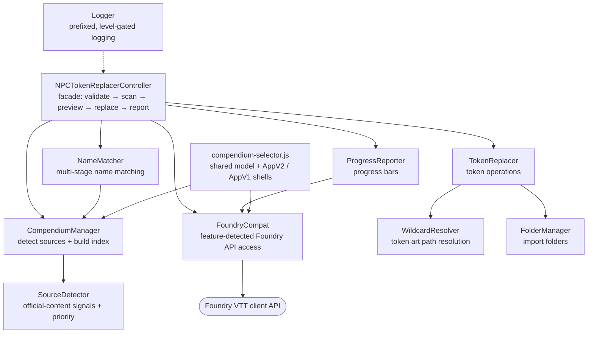

# CLAUDE.md

This file provides guidance to Claude Code (claude.ai/code) when working with code in this repository.

## ✨ Project Overview

NPC Token Replacer is a Foundry VTT module (v13 through v14+) for D&D 5e that replaces scene NPC tokens with official WotC compendium versions while preserving position, elevation, dimensions, and other token properties.

Official content is recognised in two layers: an **exact whitelist** of the packages Wizards of the Coast publishes on Foundry (trusted by default) plus **forward-looking signals** that surface books released after this version without trusting them silently. Every Foundry API that moved between generations is reached through `FoundryCompat`, which feature-detects instead of checking `game.version`.

---

## 📜 Constitution — Non-Negotiable Principles

These principles govern every change to this repository. They override
convenience, speed, and personal preference. When a request conflicts with a
principle, say so, propose the compliant alternative, and only then proceed.

### 🧱 I. Code Quality

1. **No dead code, no duplicated logic.** Two call sites doing the same thing
   share one implementation. Delete rather than comment out.
2. **One responsibility per class.** Classes stay static-only with `#private`
   state unless instance state is genuinely required.
3. **Fail loudly at the boundary, degrade gracefully in the UI.** Throw typed
   errors (`TokenReplacerError` with a `phase`) internally; surface a localized
   notification to the user.
4. **Never widen scope on error.** A failure to read configuration falls back to
   the *conservative* option, never the permissive one.
5. **Comments explain WHY.** The code already says what. Match the density and
   idiom of the surrounding file.
6. **`npm run lint` must pass with zero errors** on `scripts/` and `tools/`
   before any commit.

### 🧪 II. Testing Standards

1. **Every behavioural change ships with a test.** Bug fixes start with a test
   that fails before the fix.
2. **Test the contract, not the implementation.** Mocks execute predicates
   (`game.packs.filter = vi.fn(pred => packs.filter(pred))`), never return
   canned data that bypasses the logic under test.
3. **Both compatibility paths are tested.** Anything routed through
   `FoundryCompat` needs a test with the modern API present *and* absent.
4. **Coverage never regresses.** Currently 216 tests; a PR that lowers the
   count needs an explicit justification in the CHANGELOG.
5. **Cache-clearing in `beforeEach`.** Static caches leak between tests; clear
   every cache the test touches.

### 🎯 III. User Experience Consistency

1. **All user-facing text goes through `game.i18n`.** No hardcoded strings —
   CI fails on a key used in source but missing from `lang/en.json`.
2. **Key naming is `NPC_REPLACER.<Category>.<Key>`.** No exceptions.
3. **Destructive actions are always previewed.** The dry-run dialog is not
   optional; it lists what will change before anything changes.
4. **Every long operation reports progress** through `ProgressReporter`.
5. **Every failure the user can act on produces a notification**; everything
   else goes to the log at `debug` level.
6. **The GM can always override automatic behaviour.** Auto-detection is a
   convenience, never a cage — see the `additionalSources` setting.

### ⚡ IV. Performance Requirements

1. **Index once, reuse.** Compendium indexes, wildcard resolutions, actor
   lookups and compendium documents are cached; caches are explicitly bounded
   (LRU/FIFO) and cleared through `clearCache()`.
2. **No unbounded growth.** Any new cache declares a maximum size.
3. **Yield to the UI in long loops** (`await new Promise(r => setTimeout(r, 0))`
   every ~10 iterations) so the client never freezes.
4. **Network calls are timeout-bounded** and configurable (`httpTimeout`).
5. **Prefer O(1) lookups over scans**: name matching goes through prebuilt
   `Map` indexes, never a linear search over the full index.

### 🔍 V. Automatic Debugging & Validation

1. **`npm run check` is the gate**: lint → manifest/i18n/template validation →
   tests. It must pass locally before pushing.
2. **`tools/validate-manifest.mjs` is the source of truth** for manifest
   correctness: referenced files exist, i18n keys resolve, templates resolve,
   the download URL matches the version, and `compatibility.maximum` is never
   set.
3. **Debug surface stays available**: `window.NPCTokenReplacer` exposes the
   debug API, and `Logger.debug` output is gated behind a flag, never removed.
4. **Diagnostics record the "why"**: detection logs the tier and priority that
   led to each decision, so a misclassification is diagnosable from the console
   alone.

### 📚 VI. Research Before Implementation

1. **Verify Foundry and system APIs against current documentation** before
   using them — never from memory. Foundry's API moves every generation.
2. **Record the finding, not just the code.** A version-specific behaviour gets
   a comment naming the generation and the deprecation horizon.
3. **Feature-detect, never version-check.** `game.version` may be logged; it
   must never drive behaviour. Resolve APIs through `FoundryCompat`.
4. **Deprecated globals are reached namespace-first** so Foundry's own
   compatibility warnings stay quiet.

### 📝 VII. Documentation

1. **User-facing changes update `README.md`**; architectural changes update
   `CLAUDE.md` and `docs/`.
2. **Every release updates `CHANGELOG.md`** under Keep a Changelog headings.
3. **Docs state the current truth.** Delete stale statements rather than
   layering corrections on top.
4. **Chapter icons are consistent** across `README.md`, `CLAUDE.md` and
   `docs/` — the same concept always carries the same icon (see the icon
   legend below).

### 🧹 VIII. Repository Hygiene

1. **Only durable artifacts are tracked.** Session state, scan output, coverage
   reports and build output are gitignored.
2. **One config file per tool.** Duplicate or dead configuration is deleted.
3. **Secrets never enter the repository** — not in code, not in fixtures, not
   in tracked config.
4. **`releases/` is build output**: never edited by hand.

### 🔄 IX. CI/CD

1. **CI must be green on `develop` before a release** and runs lint,
   validation, tests on every supported Node version, plus a package smoke test.
2. **Releases are reproducible from a single trigger.** The Release workflow
   bumps, tags, builds, verifies, publishes to GitHub and announces to the
   Foundry package registry.
3. **The pipeline maintains itself**: Dependabot updates actions and dev
   dependencies; the compatibility watch opens a PR when Foundry ships a new
   generation.
4. **A workflow never fails for a reason outside its job.** Network lookups
   degrade to a no-op; `set -euo pipefail` traps are checked for `&&`
   short-circuit bugs.
5. **Nothing is published that was not validated** — the manifest validator
   runs against the exact version being shipped.

### 🤖 X. Subagent Use

1. **Delegate breadth, keep depth.** Use subagents for wide read-only sweeps
   across many files where only the conclusion matters; do focused edits
   directly.
2. **One agent per independent question**, launched in parallel — never a chain
   of agents for a task a single search answers.
3. **Never delegate a decision.** Agents gather evidence; the decision, the
   edit and the responsibility stay in the main thread.
4. **Verify agent findings before acting** on them; a confident report is not
   evidence.
5. **Never spawn an agent for a single known lookup** — read the file.

### 🎨 XI. Icon Legend

The same concept carries the same icon everywhere it appears:

| Icon | Concept |
|------|---------|
| ✨ | Features / what the module does |
| 📚 | Official D&D content, compendiums, sources |
| ⚙️ | Settings and configuration |
| 📦 | Installation and packaging |
| 🎯 | Usage and workflow |
| 🔍 | Name matching and detection |
| 🧩 | Architecture and internals |
| 🧪 | Testing |
| 🔄 | CI/CD, releases, automation |
| 🛡️ | Compatibility and version policy |
| 🐛 | Troubleshooting and debugging |
| 📜 | Principles, licence, credits |

---

## 🧩 Development Setup

This is a Foundry VTT module with no build system - plain JavaScript ES modules. To develop:

1. Symlink or copy the module to Foundry's `Data/modules/npc-token-replacer/` directory
2. Enable the module in a D&D 5e world
3. Changes to `scripts/main.js` or `scripts/lib/*.js` require a browser refresh (F5)

The `releases/` folder contains packaged releases - do not edit files there directly.

## 🔄 Build & Release

### Build the package

```bash
bash build.sh      # Linux/macOS
build.bat          # Windows
```

The build script auto-detects module ID, version, and GitHub URL from `module.json`. It creates a clean ZIP in `releases/{id}-v{version}.zip` with the download URL already set in the packaged module.json.

### Publish a new release (automated)

Releases run from **Actions → Release → Run workflow**. Pick a bump (`patch`,
`minor`, `major`, or an explicit `x.y.z`) and the workflow does everything:

1. lint + unit tests
2. bump `module.json`, `package.json` and promote the CHANGELOG `[Unreleased]` section
3. validate the manifest against the exact version being shipped
4. commit `chore: release vX.Y.Z`, tag `vX.Y.Z`, push both
5. build and verify the ZIP (manifest version matches, required files present)
6. rewrite the standalone `module.json` download/manifest URLs for this release
7. create the GitHub release with both assets (`--prerelease` when the version has a hyphen)
8. announce the release to the Foundry package registry

Pushing a `vX.Y.Z` tag by hand runs the same pipeline from step 5, after
verifying the tag matches `module.json`.

> **Why `module.json` is uploaded separately**: Foundry VTT downloads the standalone `module.json` first (via the manifest URL) to discover the module version and its download URL. The ZIP also contains a `module.json` but that's only used after installation.

### Repository secrets

| Secret | Required | Purpose |
|--------|----------|---------|
| `GITHUB_TOKEN` | provided by Actions | Create the release, push the tag, open compatibility PRs |
| `FOUNDRY_PACKAGE_TOKEN` | optional | Announce releases on the Foundry package registry. Without it that step logs a skip instead of failing. |

### Self-maintaining automation

- **`foundry-compat.yml`** runs weekly, compares the newest published Foundry
  generation with `compatibility.verified`, and opens a PR bumping it (with a
  manual smoke-test checklist) when Foundry moves ahead.
- **Dependabot** keeps the workflow actions and dev dependencies current.
- **`compatibility.maximum` must stay unset** — the manifest validator fails the
  build if it is set, because it would lock the module out of future Foundry
  generations.

### Foundry VTT Manifest URL

```
https://github.com/Aiacos/npc-token-replacer/releases/latest/download/module.json
```

## 🧩 Architecture

**Modular OOP design**: Core orchestration in `scripts/main.js` (~1260 lines) with supporting classes extracted to `scripts/lib/`. No build system — plain JavaScript ES modules.

### File Structure

```
scripts/
├── main.js                     # FolderManager, CompendiumManager, TokenReplacer,
│                               # NPCTokenReplacerController,
│                               # registerSettings(), registerControlButton(), escapeHtml()
└── lib/
    ├── logger.js               # Logger class + MODULE_ID constant
    ├── foundry-compat.js       # FoundryCompat (feature-detected Foundry API access)
    ├── source-detector.js      # SourceDetector (official-content signals + priority)
    ├── compendium-selector.js  # Settings form: shared model + AppV2/AppV1 shells
    ├── name-matcher.js         # NameMatcher (multi-stage creature name matching)
    ├── wildcard-resolver.js    # WildcardResolver (HEAD-probe token art paths)
    └── progress-reporter.js    # ProgressReporter (v12/v13+ progress bar abstraction)

tools/
├── validate-manifest.mjs       # Manifest, i18n and template validation (npm run validate)
├── bump-version.mjs            # Version bump across module.json/package.json/CHANGELOG
├── check-foundry-version.mjs   # Newest published Foundry generation vs. compatibility.verified
└── publish-foundry.mjs         # Foundry Package Release API announcement

.github/workflows/
├── ci.yml                      # Lint, validate, test matrix, package smoke test
├── release.yml                 # One-trigger release: bump → tag → build → publish
└── foundry-compat.yml          # Weekly watch: opens a PR when Foundry ships a new generation
```

### Class Hierarchy Diagram



### Class Responsibilities

| Class | Responsibility | Key Methods |
|-------|---------------|-------------|
| **NPCTokenReplacerController** | Main facade that orchestrates token replacement workflow, validates prerequisites, and coordinates all operations | `replaceNPCTokens()`, `validatePrerequisites()`, `showPreviewDialog()`, `computeMatches()`, `clearCache()`, `initialize()`, `getDebugAPI()` |
| **CompendiumManager** | Detects WOTC compendiums, manages enabled compendiums, loads monster indexes, handles compendium priorities | `detectWOTCCompendiums()`, `getEnabledCompendiums()`, `loadMonsterIndex()`, `getCompendiumPriority()`, `clearCache()` |
| **TokenReplacer** | Handles token replacement operations, imports actors, creates new tokens with preserved properties | `replaceToken()`, `extractTokenProperties()`, `getNPCTokensToProcess()`, `getNPCTokensFromScene()`, `resetCounter()` |
| **NameMatcher** | Normalizes creature names and matches them to compendium entries using multi-stage matching | `findMatch()`, `normalizeName()`, `selectBestMatch()` |
| **WildcardResolver** | Resolves Monster Manual 2024 wildcard token paths (e.g., `specter-*.webp`) to actual files | `resolve()`, `resolveWildcardVariants()`, `selectVariant()`, `isWildcardPath()`, `clearCache()` |
| **FolderManager** | Manages Actor folders for compendium imports | `getOrCreateImportFolder()`, `getFolderPath()`, `clearCache()` |
| **Logger** | Provides centralized logging with module prefix | `log()`, `error()`, `warn()`, `debug()` |
| **ProgressReporter** | Unified progress bar abstraction for v12/v13 (duck-typed version detection) | `start()`, `update()`, `finish()` |
| **FoundryCompat** | Feature-detected access to Foundry APIs that moved between generations (Dialog/DialogV2, FormApplication/ApplicationV2, SceneNavigation, template loader) | `generation`, `DialogV2`, `LegacyDialog`, `supportsApplicationV2`, `confirmDialog()`, `toElement()` |
| **SourceDetector** | Recognises official D&D packages from signals and derives their priority dynamically | `classify()`, `PRIORITY`, `TIER`, `OFFICIAL_PREFIXES` |
| **CompendiumSelectorModel** | Framework-agnostic logic behind the settings form (context, save, mode toggling) | `getContext()`, `save()`, `attachModeListeners()` |
| **buildCompendiumSelectorForm()** | Factory returning an ApplicationV2 shell when available, else the legacy FormApplication shell | — |

### Key Features by Component

**Compendium Detection** (`CompendiumManager` + `SourceDetector`): two deliberate layers.

1. **Whitelist** — `OFFICIAL_WOTC_PACKAGES`, the 11 packages Wizards of the Coast publishes on Foundry VTT. Exact, no false positives, trusted by default. Package-id prefixes (`dnd-`, `ddb-`) are **not** a signal: they also match third-party importers, homebrew and community adventures.
2. **Forward-looking signals** — WotC/Foundry Gaming authorship (`publisher` tier) or premium content declaring the active system (`premium` tier), plus package ids the GM lists in `additionalSources` (`manual` tier). These catch books released after this version. They are detected, logged and listed in the picker, but only used when the GM selects "Everything Detected" — never trusted silently.

**Priority System** (`SourceDetector.classify`): 4 tiers (Adventure > Expansion > Core > Fallback). Known packages keep their curated priority; unknown packages are classified from what their module actually ships — an Adventure pack means adventure content, Scene packs mean a setting book, neither means a rulebook.

**Selection Modes** (`enabledCompendiums` setting): `default` = every official source (the shipped default), `core` = SRD + rulebooks only, `all` = everything detected including premium and manual sources, or an explicit list of pack collection ids.

**Name Matching** (`NameMatcher.findMatch`): Exact match → variant transforms (removes prefixes/suffixes) → partial word matching

**Token Replacement** (`TokenReplacer.replaceToken`): Handles wildcard token art paths (`*.webp`), imports actors to world, creates tokens with preserved properties

**Caches** (class private static fields):
- `CompendiumManager.#indexCache`: Combined monster index from all enabled compendiums
- `CompendiumManager.#wotcCompendiumsCache`: Detected WotC compendiums
- `FolderManager.#importFolderCache`: Actor folder for imports
- `WildcardResolver.#variantCache`: Resolved wildcard paths
- `TokenReplacer.#actorLookup`: Session-scoped UUID→world Actor map (prevents duplicate imports)
- `TokenReplacer.#compendiumDocCache`: LRU cache for `pack.getDocument()` results (max 100)
- `NPCTokenReplacerController.#isProcessing`: Execution lock
- `TokenReplacer.#sequentialCounter`: Token variant counter
- `CompendiumManager.#classifications`: packCollection -> `SourceDetector` classification (tier + priority)

### Foundry Integration Points

- `Hooks.once("init")`: Register settings
- `Hooks.once("ready")`: Initialize controller, pre-cache monster index
- `Hooks.on("getSceneControlButtons")`: Add toolbar button (handles both v12 array and v13 object formats)
- `window.NPCTokenReplacer`: Debug API exposed globally via `NPCTokenReplacerController.getDebugAPI()`

## 🧩 Key Patterns

**Version Compatibility**: Never branch on `game.version`. Foundry APIs that moved between generations are reached through `FoundryCompat`, which resolves the namespaced API first and only falls back to the deprecated global. `registerControlButton` handles both the v12 array-based controls (`onClick`) and the v13+ object-based controls (`onChange`) — attaching both callbacks makes v13 fire the action twice.

**Application Framework**: `buildCompendiumSelectorForm()` resolves its base class *at registration time*. A `class X extends FormApplication` declaration would evaluate the global at module load and break the whole module on a Foundry version that removed it (planned for v16).

**Settings Storage**: Compendium selection is stored as JSON string (`JSON.stringify`/`JSON.parse`) for reliability across Foundry versions.

**Wildcard Token Resolution**: Monster Manual 2024 uses wildcard patterns like `specter-*.webp`. The `WildcardResolver` class probes for numbered variants (1-5, 01-05, a-e) via HEAD requests and selects based on variation mode setting.

**Private Fields**: All classes use ES6 private static fields (`#field`) for internal state and caching, preventing external access and ensuring encapsulation.

**Static Methods**: Most classes use static methods since they don't need instance state - this simplifies the API and avoids instantiation overhead.

**Blocklists over allowlists for forward compatibility**: `CompendiumManager.isCreatureEntry` excludes known non-creature actor types rather than listing the allowed ones, so an actor type introduced by a future system version is still indexed.

## 🐛 Console Debugging

```javascript
NPCTokenReplacer.replaceNPCTokens();      // Run replacement
NPCTokenReplacer.detectWOTCCompendiums(); // List detected compendiums
NPCTokenReplacer.getEnabledCompendiums(); // List enabled compendiums
NPCTokenReplacer.clearCache();            // Force index reload
NPCTokenReplacer.getNPCTokensFromScene(); // Get NPC tokens in current scene
NPCTokenReplacer.findInMonsterManual(name, index); // Find creature in index
NPCTokenReplacer.getOrCreateImportFolder(); // Get/create import folder
NPCTokenReplacer.getLastLoadErrors();     // Compendiums that failed to index
NPCTokenReplacer.debugEnabled = true;     // Verbose logging, including detection tiers
```

## ⚙️ Localization

All user-facing strings use `game.i18n.localize()` with keys from `lang/en.json`. Pattern: `NPC_REPLACER.<Category>.<Key>`.

## 🧩 Utility Functions

In addition to classes, three standalone utility functions remain:
- `registerSettings()`: Registers module settings during init hook
- `registerControlButton(controls)`: Adds the replace button to token controls
- `escapeHtml(str)`: Escapes HTML special characters for safe display

## ⚙️ Configuration Constants

```javascript
const MODULE_ID = "npc-token-replacer";           // Module identifier
const DEFAULT_HTTP_TIMEOUT_MS = 5000;             // HTTP timeout for HEAD requests
const OFFICIAL_WOTC_PACKAGES = [ /* 11 ids */ ];  // Authoritative whitelist
const KNOWN_MODULE_LABELS = {...};                // Human-readable book names
const OFFICIAL_AUTHOR_PATTERN = /wizards of the coast|foundry gaming/i;
const PRIORITY = { FALLBACK: 1, CORE: 2, EXPANSION: 3, ADVENTURE: 4 };
const TIER = { SYSTEM, OFFICIAL, PUBLISHER, PREMIUM, MANUAL, NONE };
const KNOWN_PRIORITIES = {...};                   // Priorities for the whitelist
const WOTC_MODULE_PREFIXES = ["dnd-", "dnd5e"];   // DEPRECATED since 1.6.0, unused
```

## 🧪 Quality Gate

```bash
npm run lint       # ESLint over scripts/, tools/ and tests/
npm run validate   # module.json, referenced files, i18n keys, template paths
npm test           # Vitest unit suite
npm run check      # All three, in order — run this before pushing
```
