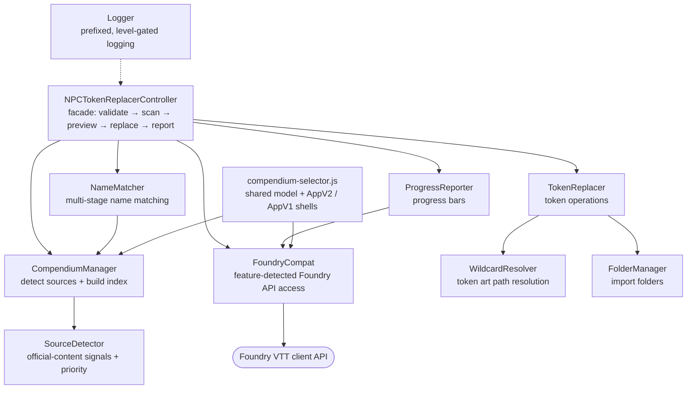

# NPC Token Replacer

**English** · [Italiano](README.it.md)

A Foundry VTT module that automatically replaces NPC tokens in your scene with official D&D compendium versions, preserving their position, elevation, dimensions, and visibility.

## ✨ Features

- **One-Click Replacement**: Adds a button to the Token Controls toolbar for easy access
- **Automatic Compendium Detection**: Finds every installed official D&D source from package signals - the system SRD, any `dnd-` module, anything authored by Wizards of the Coast, and premium D&D content. There is no list to maintain, so books released after this module still work.
- **Multi-Compendium Support**: Search across multiple official D&D compendiums simultaneously
- **Smart Priority System**: Prefers adventure/expansion creatures over Monster Manual over SRD
- **Configurable Compendium Selection**: Read every official source (default), restrict to core rulebooks, include premium third-party content, or pick compendiums one by one
- **Future-Proof by Design**: Foundry APIs are feature-detected, never version-checked, so the module keeps working across Foundry generations - minimum v13, verified on v14
- **Preserves Token Properties**: Maintains position, elevation, dimensions, visibility, rotation, and disposition
- **Confirmation Dialog**: Shows a list of tokens to be replaced before proceeding
- **Detailed Logging**: Provides console logs for debugging and tracking
- **Smart Name Matching**: Handles variations in creature names (e.g., "Goblin Warrior" matches "Goblin")
- **Token Variation Mode**: Choose how to handle multiple token art variations (None/Sequential/Random)
- **Folder Organization**: Automatically organizes imported monsters into folders

## 📚 Supported Official D&D Content

By default the module trusts **exactly the 11 official Wizards of the Coast
packages published on Foundry VTT** (see the
[Foundry VTT creator page](https://foundryvtt.com/creators/wizards-of-the-coast/)).
A package id prefix is never enough on its own — `dnd-` and `ddb-` are also used
by importers, homebrew and community adventures.

On top of that whitelist the module watches for **content it has never heard of**
and tells you about it, instead of silently ignoring it:

| How a source is recognised | Example | Tier | Used by default |
|----------------------------|---------|------|-----------------|
| The active game system's own compendiums | `dnd5e` SRD monsters | SRD | ✅ |
| In the official WotC package list | `dnd-monster-manual` | Official | ✅ |
| Authored by Wizards of the Coast / Foundry Gaming | a book released after this version | Looks official | ⚙️ opt-in |
| Premium content declaring the dnd5e system | paid third-party bestiaries | Premium | ⚙️ opt-in |
| Package id you added under **Additional Compendium Sources** | anything else | Manual | ⚙️ opt-in |

When a new official book is installed, it is detected as **"Looks official"**,
logged with a warning naming the package, and listed in the compendium picker —
switch to **Everything Detected** to start using it immediately, without waiting
for a module update.

Third-party content — DDB-Importer (`ddb-*`), community homebrew modules, and
legacy books that have never been ported to Foundry by WotC (Volo's, MToF,
MPMM, Fizban's, Curse of Strahd, Icewind Dale, Descent into Avernus, etc.) —
is deliberately excluded from the whitelist.

The 11 trusted packages, and the priority each resolves to:

### Priority 4 — ADVENTURE (highest — adventure-specific tokens preferred)

| Module ID | Content |
|-----------|---------|
| `dnd-phandelver-below` | Phandelver and Below: The Shattered Obelisk |
| `dnd-tomb-annihilation` | Tomb of Annihilation |
| `dnd-adventures-faerun` | Forgotten Realms: Adventures in Faerûn |
| `dnd-heroes-faerun` | Forgotten Realms: Heroes of Faerûn |
| `dnd-heroes-borderlands` | Heroes of the Borderlands |

### Priority 3 — EXPANSION

| Module ID | Content |
|-----------|---------|
| `dnd-forge-artificer` | Eberron: Forge of the Artificer |

### Priority 2 — CORE (2024 editions)

| Module ID | Content |
|-----------|---------|
| `dnd-monster-manual` | Monster Manual (2024) |
| `dnd-players-handbook` | Player's Handbook (2024) |
| `dnd-dungeon-masters-guide` | Dungeon Master's Guide (2024) |

### Priority 1 — FALLBACK (SRD & options)

| Module ID | Content |
|-----------|---------|
| `dnd5e` | D&D 5e System SRD Monsters (free) |
| `dnd-tashas-cauldron` | Tasha's Cauldron of Everything |

### 📚 Compendium Priority System

When the same creature exists in multiple compendiums, the module uses a 4-tier priority
system to select the best match:

1. **Priority 4 – ADVENTURE**: Creatures from adventure modules are preferred — they carry
   adventure-specific art and stat blocks.
2. **Priority 3 – EXPANSION**: Expansion books with new or variant creatures.
3. **Priority 2 – CORE**: 2024 core rulebooks (Monster Manual, PHB, DMG).
4. **Priority 1 – FALLBACK**: SRD and options (Tasha's), used as last resort.

This ensures you always get the best available token art and creature data.

A package outside the whitelist never receives an implicit priority. If it is
picked up by one of the opt-in signals, it is classified from what its module
actually ships — an Adventure compendium means adventure content (4), Scene
compendiums mean a setting book (3), neither means a rulebook (2).

Only Actor entries that can stand in for an NPC are indexed: player characters,
groups and vehicles in those compendiums are skipped.

## 🛡️ Requirements

- **Foundry VTT**: Version 13 or higher (verified on v14)
- **System**: D&D 5th Edition (dnd5e) v4.0.0+
- **Official D&D Content**: At least one official D&D module with Actor compendiums (e.g., Monster Manual 2024)

## 📦 Installation

> **Not yet in Foundry's package browser.** This module has not been submitted to
> the official Foundry package registry, so searching for it inside Foundry's
> **Install Module** dialog will not find it. Use the manifest URL below
> (Method 2) — it is the recommended way, and Foundry will keep the module
> updated from it automatically, exactly as it would for a listed package.

### 📦 Method 1: Manual Installation

1. Download the latest release from this repository
2. Extract the contents to your Foundry VTT modules folder:
   - Windows: `%localappdata%/FoundryVTT/Data/modules/`
   - macOS: `~/Library/Application Support/FoundryVTT/Data/modules/`
   - Linux: `~/.local/share/FoundryVTT/Data/modules/`
3. Rename the extracted folder to `npc-token-replacer`
4. Restart Foundry VTT
5. Enable the module in your world's module settings

### 📦 Method 2: Manifest URL (recommended)

1. In Foundry VTT, go to **Add-on Modules** tab
2. Click **Install Module**
3. Paste the manifest URL in the **Manifest URL** field:
   ```
   https://github.com/Aiacos/npc-token-replacer/releases/latest/download/module.json
   ```
4. Click **Install**
5. Enable the module in your world's module settings

## 🎯 Usage

1. Open a scene with NPC tokens placed on it
2. Select the **Token Controls** layer (the person icon in the left toolbar)
3. **Optional**: Select specific tokens to replace only those (if no tokens selected, all scene NPCs will be processed)
4. Click the **Replace NPC Tokens** button (sync icon)
5. A confirmation dialog will appear showing the NPC tokens that will be replaced
6. Click **Replace Tokens** to proceed or **Cancel** to abort
7. The module will:
   - Search all enabled compendiums for matching creatures
   - Delete the original tokens
   - Create new tokens from the compendium with the original position, elevation, size, and visibility
8. A notification will show the results

### 🎯 Selection Mode

- **With selected tokens**: Only the selected NPC tokens will be replaced
- **Without selection**: All NPC tokens in the scene will be replaced

## 🎯 Token Properties Preserved

When replacing tokens, the following properties are preserved from the original token:

| Property | Description |
|----------|-------------|
| Position (x, y) | Exact grid position |
| Elevation | Vertical elevation value |
| Dimensions (width, height) | Token size in grid cells |
| Hidden | Visibility state (hidden/visible) |
| Rotation | Token rotation angle |
| Disposition | Hostile, Neutral, or Friendly |
| Locked | Whether the token is locked |
| Alpha | Token opacity |

## ⚙️ Module Settings

Access the module settings via **Game Settings** > **Configure Settings** > **Module Settings** > **NPC Token Replacer**.

| Setting | Options | Description |
|---------|---------|-------------|
| Token Variation Mode | None, Sequential, Random | How to select token art when multiple variations are available |
| Preview Dialog Timeout | 1-30 minutes (default: 5) | How long to wait before auto-closing the preview dialog |
| HTTP Timeout | 1-30 seconds (default: 5) | Timeout for network requests when resolving wildcard token paths |
| Additional Compendium Sources | Comma-separated ids | Package or compendium ids to treat as official creature sources. Only needed for content the module cannot recognise on its own. |
| Configure Compendiums | Button | Opens dialog to select which compendiums to use |

### ⚙️ Token Variation Mode

Some creatures have multiple token art variations. This setting controls how the module selects which variation to use:

- **None**: Always use the first available variation
- **Sequential** (default): Cycle through variations in order. If you have 5 Goblins in a scene, they'll get variations 1, 2, 3, 4, 5 (or wrap around if fewer variations exist)
- **Random**: Randomly select a variation for each token

### ⚙️ Compendium Selection

The module offers four compendium selection modes:

| Mode | Description |
|------|-------------|
| **All Official D&D Content** (Default) | Reads every official source detected in this world - the system SRD plus every Wizards of the Coast module. Newly installed books are picked up on their own. |
| **Core Rulebooks + SRD Only** | Restricts matching to the SRD and the core rulebooks (Monster Manual, PHB, DMG). Adventures and expansions are ignored. |
| **Everything Detected** | Also includes premium D&D content from other publishers and anything added under **Additional Compendium Sources**. |
| **Custom Selection** | Manually select which compendiums to use. |

> Upgrading from 1.4.x? The default changed: worlds that never touched this
> setting now read **all** official content instead of just the core rulebooks.
> Pick **Core Rulebooks + SRD Only** to restore the old behaviour.

To configure:
1. Open Module Settings
2. Click **Configure Compendiums**
3. Select your preferred mode
4. If using Custom Selection, check the specific compendiums you want
5. Click Save

## 🔍 Name Matching

The module uses intelligent name matching to find creatures in the compendiums:

1. **Exact Match**: First tries to find an exact name match
2. **Variant Matching**: Removes common prefixes/suffixes:
   - Prefixes: "Young", "Adult", "Ancient", "Elder", "Greater", "Lesser"
   - Suffixes: "Warrior", "Guard", "Scout", "Champion", "Leader", "Chief", "Captain", "Shaman", "Berserker"
3. **Partial Match**: Checks if names share significant words (4+ characters)

### 🔍 Examples

| Scene Token | Compendium Match |
|-------------|------------------|
| "Goblin" | "Goblin" |
| "Goblin Warrior" | "Goblin" |
| "Young Red Dragon" | "Red Dragon" |
| "Orc War Chief" | "Orc" |

## 🐛 Console Commands

For debugging or manual control, you can use these commands in the browser console (F12):

```javascript
// Run the token replacement manually
NPCTokenReplacer.replaceNPCTokens();

// Get all detected WOTC compendiums
NPCTokenReplacer.detectWOTCCompendiums();

// Get currently enabled compendiums
NPCTokenReplacer.getEnabledCompendiums();

// Get all NPC tokens in the current scene
NPCTokenReplacer.getNPCTokensFromScene();

// Clear the cached monster index (forces reload)
NPCTokenReplacer.clearCache();
```

## 🐛 Troubleshooting

### 🐛 "No official D&D compendiums found"

Make sure you have installed and enabled at least one official D&D module with Actor compendiums (e.g., Monster Manual 2024, Phandelver and Below, etc.).

### 🐛 "No compendiums available for token replacement"

The module couldn't find any enabled compendiums. Check:
1. You have official D&D content installed
2. The compendiums are enabled in the module settings
3. Check the console (F12) for detected compendiums

### 🐛 Tokens not being matched

Check the console log for details on which creatures weren't found. The matching algorithm tries to be flexible, but some custom or homebrew creatures may not have equivalents in the official compendiums.

### 🐛 Some tokens show errors

If specific tokens fail to replace, check the console for error details. Common causes:
- Corrupted token data
- Missing actor references
- Permission issues

## 🛡️ Compatibility

| Foundry | Status | Notes |
|---------|--------|-------|
| v12 | Not supported since 1.6.0 | The compatibility layer still carries the AppV1 fallbacks, but the manifest requires 13 |
| v13 | Supported (minimum) | Object-based scene controls, notification progress bar |
| v14 | Verified | Current stable; AppV1 classes still present but deprecated |
| v15+ | Expected to work | No `compatibility.maximum` is declared and every moved API is feature-detected, so newer generations are not blocked |

The module resolves Foundry APIs by checking what exists, never by comparing
version numbers: `DialogV2` and `ApplicationV2` are used when present, with the
AppV1 classes as the fallback. A weekly CI job watches for new Foundry releases
and opens a pull request bumping the verified generation.

**D&D 5e system**: required. No maximum system version is declared either.

## 🛡️ Known Limitations

- Only works with NPC-type actors (character, group and vehicle entries are skipped)
- Requires at least one official D&D module with Actor compendiums
- Custom/homebrew creatures without official compendium equivalents will be skipped
- Token art from the compendium will replace any custom token art

## 🧩 Architecture

The module follows an object-oriented design with well-defined classes, each with a single responsibility. Core orchestration lives in `scripts/main.js` with supporting classes extracted to `scripts/lib/` — all plain JavaScript ES modules (no build system required).

### 🧩 Class Hierarchy



### 🧩 Class Responsibilities

| Class | Purpose |
|-------|---------|
| **NPCTokenReplacerController** | Main facade that orchestrates the token replacement workflow, validates prerequisites, and coordinates all operations |
| **CompendiumManager** | Detects WotC compendiums, manages enabled compendiums, loads monster indexes, and handles compendium priorities |
| **TokenReplacer** | Handles token replacement operations, imports actors to world, and creates new tokens with preserved properties |
| **NameMatcher** | Normalizes creature names and matches them to compendium entries using multi-stage matching algorithms |
| **WildcardResolver** | Resolves Monster Manual 2024 wildcard token paths (e.g., `specter-*.webp`) to actual image files |
| **FolderManager** | Manages Actor folders for organizing compendium imports |
| **ProgressReporter** | Unified progress bar abstraction handling v12 (SceneNavigation) and v13+ (notification) APIs |
| **Logger** | Provides centralized logging with consistent module prefix formatting |
| **FoundryCompat** | Feature-detected access to Foundry APIs that moved between generations (dialogs, applications, navigation, template loading) |
| **SourceDetector** | Recognizes official D&D packages from signals and derives their priority from what each module ships |
| **CompendiumSelectorModel** | Framework-agnostic logic behind the compendium selection UI, shared by the ApplicationV2 and legacy FormApplication shells |

### 🧩 Design Patterns

- **Facade Pattern**: `NPCTokenReplacerController` provides a simplified interface to the complex subsystem of classes
- **Static Methods**: Most classes use static methods since they don't require instance state
- **Private Fields**: ES6 private static fields (`#field`) ensure encapsulation and prevent external access to internal state
- **Caching**: Multiple classes implement caching for performance (compendium indexes, folder references, wildcard paths), each with an explicit bound
- **Feature Detection over Version Checks**: `FoundryCompat` resolves each API by asking whether it exists, so a new Foundry generation needs no code change
- **Signal-Based Detection**: `SourceDetector` classifies content from package metadata instead of a hardcoded module list

### 🧩 Foundry Integration

The module integrates with Foundry VTT through these hooks:

- `Hooks.once("init")`: Registers module settings
- `Hooks.once("ready")`: Initializes the controller and pre-caches monster indexes
- `Hooks.on("getSceneControlButtons")`: Adds the toolbar button (v12 array format uses `onClick`, v13+ object format uses `onChange`)

A global debug API is exposed via `window.NPCTokenReplacer` for console access.

## 🔄 Development & Releases

| Command | Purpose |
|---------|---------|
| `npm test` | Run the unit suite (232 tests) |
| `npm run lint` | ESLint over `scripts/`, `tools/` and `tests/` |
| `npm run validate` | Verify `module.json`, referenced files, i18n keys and template paths |
| `npm run check` | All three, in order |
| `bash build.sh` | Build the distributable ZIP into `releases/` |

Releases are produced by the **Release** GitHub Actions workflow from a single
trigger: it bumps the version, tags, builds, verifies the package, publishes the
GitHub release and announces it to the Foundry package registry.

### 🔄 Listing the module on foundryvtt.com

The module is distributed by manifest URL and is **not** listed in Foundry's
built-in package browser. Getting it listed is a one-time process, and it must
happen before the release pipeline can announce new versions to Foundry: the
`FOUNDRY_PACKAGE_TOKEN` used for that is issued per package and only exists once
a package has been approved.

**1. Submit the package** — requires an account holding an active Foundry VTT
licence. Sign in to [foundryvtt.com](https://foundryvtt.com/) and open
`https://foundryvtt.com/packages/submit`.

**2. Wait for review** — submissions are reviewed manually. The review asks
whether the author holds the rights to everything the package contains, whether
it includes another company's content and meets that company's licensing terms,
and whether it includes art the author did not create.

This module ships **no D&D content**: no text, no stat blocks, no art. It only
reads compendiums the user already owns, from modules they bought themselves.

**3. Copy the release token** — after approval, open the package edit page from
**Profile → Packages → Edit**. Just above the **Save Package** button is a field
labelled **Package Release Token**; click it to copy. Nothing needs generating,
the token already exists.

**4. Store it as a repository secret** — run this in your own terminal so the
value never reaches a shell history or a transcript:

```bash
gh secret set FOUNDRY_PACKAGE_TOKEN
```

Until that is done nothing breaks: the release workflow's registry step logs a
skip and exits cleanly, releases still reach GitHub, and the manifest URL keeps
serving updates to everyone who installed from it.

Full details, including what to do if the token leaks and how to validate it
with a dry run, are in [`docs/DEVELOPMENT.md`](docs/DEVELOPMENT.md).

See also [`docs/COMPATIBILITY.md`](docs/COMPATIBILITY.md) for the Foundry
version-support policy.

## 🧪 Contributing

Contributions are welcome! Please feel free to submit issues or pull requests.

## 📜 License

This module is released under the MIT License.

## 📜 Credits

- Developed for use with Foundry Virtual Tabletop
- Official D&D content is owned by Wizards of the Coast
